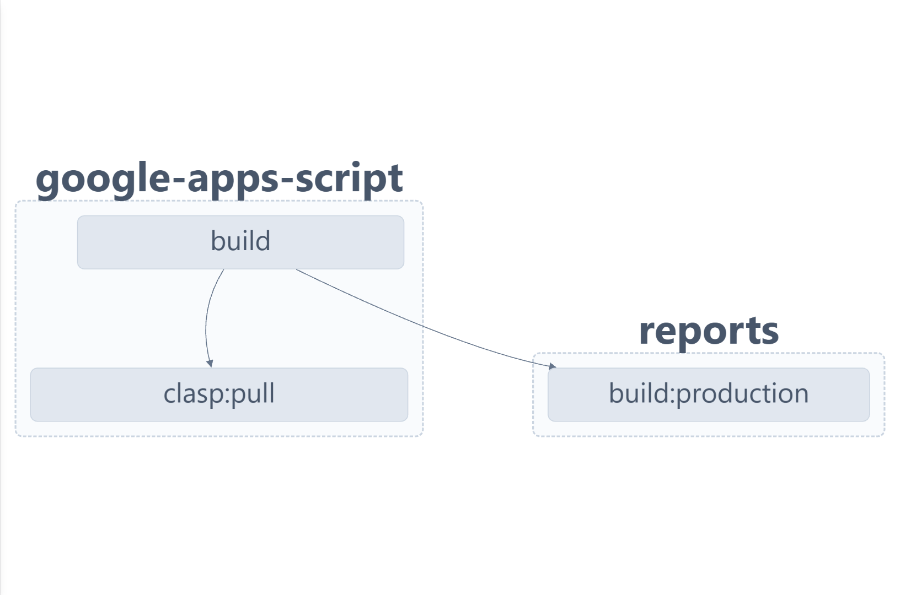

## Deployment process

[↩ Back to main](../README.md)

---

### Using tools

- **NX** is a tool for multiple projects in one monorepo. There are its key features bellow:

  - **All in one:** Manages multiple projects of different kinds. In this repository we have not only _Google Apps Script_ related code but also _Angular_ web applications.
  - **Scripts runner:** Provides a way to launch project specific scripts. For consistency CI/CD launches the same scripts as user does.
  - **Solving dependencies:** NX automatically tracks dependencies, and efficiently detects which projects have changed between git branches.
  - **Only changed code:** It ensures that only the affected projects and their dependencies are built, tested, or linted, optimizing workflow.

- **CLASP** is a command-line tool to synchronize the code in the git repository with Google Apps Script project. Project id is provided by _environment variable_ and is not pushed to the git repository.

- **DOTENVX** is a Node.js library that enables loading of environment variables from `.env` files across different platforms. It ensures consistent configuration handling in both Linux CI/CD environments and Windows development setups.

### Build projects flow

There is a graph of build process bellow. It was generated automatically by _NX_ tool. You can see the dependencies of main _build script_ which are running during the build process.



### GitHub actions description

There are two workflows. First verifies that merging code is ready to be merged. Second runs when code was merged and deploys code to Google Apps Script project.

#### Common behaviour

There are the steps bellow in the both pipelines.

- **Using Node.js:** Installs Node.js of specific version to build project and use CI/CD tools.

```yaml
- name: Use Node.js ${{ env.NODE_VERSION }}
  uses: actions/setup-node@v4
  with:
    node-version: ${{ env.NODE_VERSION }}
    cache: 'npm'
```

- **_.env_ file:** Saves GitHub repository secrets to _.env_ file. _.env_ file is used for consistency of CI/CD with developer environments. Developer's values are stored in _.env_ file and are not pushed to the git repository.

```yaml
- name: Create .env file
  run: echo "GOOGLE_SCRIPT_PROJECT_ID=${{ secrets.GOOGLE_SCRIPT_PROJECT_ID }}" > .env
```

- **Clasp credentials:** This step saves Google credentials from GitHub repository secrets to the _~/.clasprc.json_ file. Clasp command-line tool uses the file to pull and push to Google.

```yaml
- name: Create a file for Clasp credentials
  id: write-clasprc
  run: echo "$CLASPRC_JSON_SECRET" >> ~/.clasprc.json
  env:
    CLASPRC_JSON_SECRET: ${{ secrets.CLASPRC_JSON }}
```

- **Get the project files from Google:** Some files are able to create only on Google Script App project side. First we get those files, then we put the built scripts into them.

```yaml
- name: Clone Google Apps Script project
  run: npx nx run google-apps-script:clasp --configuration=clone
```

#### Pull Request verification ([`verification.yml`](../.github/workflows/verification.yml))

This workflow runs when a pull request is opened or updated. If any step fails, the pull request cannot be merged, helping maintain code quality and stability. 🚦

- **Checkout code:** Gets the code from all branches. _NX_ tool needs current and main branhes to build only the changed projects. We don't need to build everything and push. We only verify the changed code for the build errors.

```yaml
- name: Checkout code
  uses: actions/checkout@v4
  with:
    fetch-depth: 0 # To compare this branch with the main branch and determine affected projects
```

TODO: add other tasks.

- **:**

```yaml
- name: Build
  run: npx nx affected --target=build --base=origin/main --head=HEAD
```

#### Deployment workflow ([`deploy.yml`](../.github/workflows/deploy.yml)`)

This workflow automates the deployment process to Google whenever changes are pushed to the `main` branch.

- **Checkoud code:** Gets the code from main branches only. After push everything is rebuild and pushed to Google.

TODO: Complete tasks description and add new ones.

```yaml
- name: Checkout code
  uses: actions/checkout@v4
```

- **:**

```yaml
- name: Build root project
  run: npx nx run google-apps-script:build --verbose
```

- **:**

```yaml
- name: Push changes to Google Apps Script
  run: npx nx run google-apps-script:clasp --configuration=push
```
